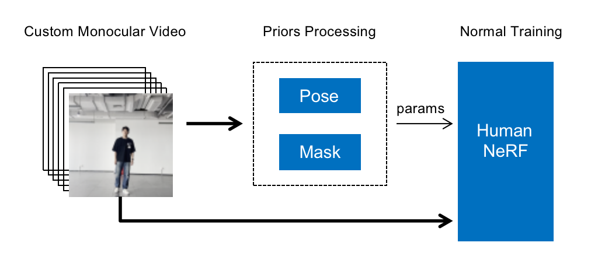

# easyHumanNeRF
End-to-end Implementation of HumanNeRF with custom dataset

using [HumanNeRF](https://github.com/chungyiweng/humannerf)+[VIBE](https://github.com/mkocabas/VIBE)+[YOLOv7](https://github.com/WongKinYiu/yolov7)

`paper`
**HumanNeRF: Free-viewpoint Rendering of Moving People from Monocular Video**

## Demo of custom data

| <h2 align="center"> FreeView </h2> | <h2 align="center"> Movement </h2> | <h2 align="center"> TPose </h2> |
| :---: | :---: | :---: |
| <video src="./assets/Dunhuang_fvv.mov" alt="drawing" height=200 />| <video src="./assets/Taekwondo_fvv.mov" alt="drawing" height=200 />|<video src="./assets/Kungfu_Sword_fvv.mov" alt="drawing" height=200 />|

## Pipeline
<p float="center">
  
</p>

## Prerequisite

### `Configure environment`

Create and activate a virtual environment.

    conda create --name humannerf python=3.7
    conda activate humannerf

Install the required packages.

    pip install -r requirements.txt

### `Download SMPL model`

Download the gender neutral SMPL model from [here](https://smplify.is.tue.mpg.de/), and unpack **mpips_smplify_public_v2.zip**.

Copy the smpl model.

    SMPL_DIR=/path/to/smpl
    MODEL_DIR=$SMPL_DIR/smplify_public/code/models
    cp $MODEL_DIR/basicModel_neutral_lbs_10_207_0_v1.0.0.pkl third_parties/smpl/models

Follow [this page](https://github.com/vchoutas/smplx/tree/master/tools) to remove Chumpy objects from the SMPL model.

## Fast Train

```bash
git clone https://github.com/IVL-PKU/easyHumanNeRF.git
cd easyHumanNeRF/
vim easy_train
```
set your path of images:
```bash
IMAGES="your/images/"  # please use absolute path
```

```bash
sh easy_train.sh
```

### `Render output`

Render the frame input (i.e., observed motion sequence).

    python run.py \
        --type movement \
        --cfg configs/human_nerf/wild/monocular/adventure.yaml

Run free-viewpoint rendering on a particular frame (e.g., frame 128).

    python run.py \
        --type freeview \
        --cfg configs/human_nerf/wild/monocular/adventure.yaml \
        freeview.frame_idx 128


Render the learned canonical appearance (T-pose).

    python run.py \
        --type tpose \
        --cfg configs/human_nerf/wild/monocular/adventure.yaml

In addition, you can find the rendering scripts in `scripts/wild`.


## TODO LIST

- [ ] The schedule
  - [x] end-to-end training HumanNeRF
  - [ ] detailed README
  - [ ] acceleration
  - [ ] Multi-view HumanNeRF


## Acknowledge

easyHumanNeRF is an integration of [HumanNeRF](https://github.com/chungyiweng/humannerf), [VIBE](https://github.com/mkocabas/VIBE) and [YOLOv7](https://github.com/WongKinYiu/yolov7). If this is helpful to you, please give stars to the above works. Thanks!
